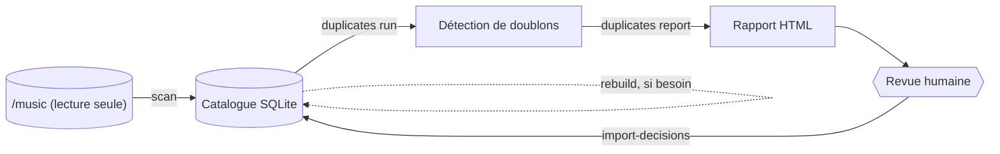

# djlib

*Un catalogue local et déterministe pour une archive DJ, qui détecte les
doublons sans jamais toucher aux fichiers sources.*

---

## Sommaire

- [Qu'est-ce que djlib ?](#quest-ce-que-djlib-)
- [Comment ça fonctionne](#comment-ça-fonctionne)
- [Installation](#installation)
- [Configuration](#configuration)
- [Les commandes](#les-commandes)
- [Aller plus loin](#aller-plus-loin)
- [Développement](#développement)

## Qu'est-ce que djlib ?

Après des années de mix, une archive DJ finit toujours par ressembler à
ça : des dizaines de milliers de fichiers audio, collectés au fil du temps
sur différents supports, avec le même morceau qui traîne en plusieurs
copies — parfois identiques, parfois juste ré-encodées, parfois carrément
une autre version (remix, radio edit...) qu'il ne faut surtout pas
confondre avec l'originale.

**djlib** est un outil en ligne de commande qui :

- **cataloge** chaque fichier audio de l'archive (métadonnées, format,
  empreinte technique) ;
- **résout** une identité propre pour chaque morceau (artiste, titre,
  version, édition), même quand les tags sont absents ou incohérents ;
- **détecte les doublons** — copies binaires identiques, mêmes morceaux
  ré-encodés dans un autre format — sans jamais confondre deux versions
  réellement distinctes du même titre ;
- **propose**, pour chaque doublon confirmé, un fichier "préféré" (le
  mieux encodé, le plus fiable) ;
- **laisse l'humain trancher** dès qu'il y a la moindre ambiguïté, via un
  rapport HTML consultable dans un navigateur.

> [!IMPORTANT]
> **djlib ne modifie jamais un fichier sous `music_root`.** Il ne
> renomme rien, ne déplace rien, ne supprime rien, ne retague rien. Son
> rôle s'arrête à l'analyse, à la proposition, et à la mémorisation des
> décisions humaines — décider quoi faire *physiquement* d'un doublon reste
> une action manuelle de l'opérateur.

Ce projet cible en priorité un usage en **conteneur Proxmox LXC dédié**,
avec l'archive source montée en lecture seule — mais il tourne tout aussi
bien sur un poste de développement ou de test classique.

## Comment ça fonctionne

L'idée centrale : la base de données (`catalog.sqlite`) n'est qu'une **vue
reconstructible** de ce qui existe réellement sur le disque, enrichie de
l'historique des décisions humaines. Rien de ce qui compte n'est jamais
perdu, puisque tout peut être reconstruit depuis l'archive source et un
simple journal.



En pratique, un cycle d'utilisation ressemble à ceci :

1. `djlib scan` parcourt l'archive et met à jour le catalogue ;
2. `djlib duplicates run` détecte les doublons, calcule les preuves
   nécessaires (hash, empreinte acoustique, qualité) et ne consolide
   **automatiquement** que les cas sans ambiguïté ;
3. `djlib duplicates report` génère une page HTML pour trancher les cas
   ambigus à la main, dans un navigateur ;
4. `djlib duplicates import-decisions` applique ces décisions, de façon
   atomique et irréversible-par-erreur ;
5. `djlib rebuild`, en cas d'incident sur la base, reconstruit tout depuis
   l'archive et l'historique des décisions — sans rien redemander à
   personne.

Le fonctionnement détaillé (composants, modèle de données, cycles de vie)
est expliqué dans **[`docs/architecture.md`](docs/architecture.md)**.

## Installation

| | Conteneur Proxmox LXC (production) | Poste local (développement, test, ou tout autre usage) |
| --- | --- | --- |
| Isolation | `/music` physiquement en lecture seule | dépend de votre configuration |
| Mise en route | une seule commande | `pip install` |
| Recommandé pour | un usage réel, au long cours | contribuer, tester, explorer |

**Conteneur Proxmox, en une commande** (sur l'hôte, en root) :

```bash
CTID=200 MUSIC_SRC=/mnt/tank/djing DATA_SRC=/mnt/tank/djlib \
  bash -c "$(curl -fsSL https://raw.githubusercontent.com/fmatsos/djlib/main/infra/lxc/create-container.sh)"
```

**Poste local :**

```bash
python -m pip install -e '.[dev]'
djlib --help
```

Le guide complet — installation manuelle étape par étape, mise à jour,
exécution de `djlib rebuild` en tâche de fond, toutes les variables
d'environnement — vit dans
**[`docs/installation.md`](docs/installation.md)**.

## Configuration

djlib lit ses chemins depuis une section `[paths]` d'un fichier TOML (voir
[`config.example.toml`](config.example.toml)), désigné par la variable
d'environnement `DJLIB_CONFIG` :

```bash
DJLIB_CONFIG=/etc/djlib/config.toml djlib scan
```

Sans configuration fournie, les valeurs par défaut sont :

```toml
[paths]
music_root = "/music"   # archive source, en lecture seule
data_root  = "/data"    # état de djlib (catalog.sqlite, logs, etc.)
```

Une section `[duplicates]` (`duration`, `chromaprint`) permet d'ajuster la
tolérance de durée et les seuils de classification Chromaprint — voir
[`config.example.toml`](config.example.toml) pour chaque clé et sa valeur
par défaut, et `djlib duplicates calibrate`
([`docs/commandes.md`](docs/commandes.md#djlib-duplicates-calibrate)) pour
les ajuster sur de vraies données.

## Les commandes

| Commande | Rôle en une phrase |
| --- | --- |
| `djlib doctor` | Bilan de santé complet de l'installation. |
| `djlib scan` | Met à jour le catalogue depuis l'archive source. |
| `djlib duplicates detect` | Repère les doublons candidats (métadonnées seules, pas cher). |
| `djlib duplicates analyze` | Calcule les preuves et classe les candidats déjà détectés. |
| `djlib duplicates run` | `detect` + `analyze` + consolidation automatique des cas sûrs. |
| `djlib duplicates stats` | Compteurs par statut de groupe et par classification. |
| `djlib duplicates calibrate` | Exporte les preuves pour ajuster les seuils à la main. |
| `djlib duplicates report` | Génère le rapport HTML de revue humaine. |
| `djlib duplicates import-decisions` | Applique les décisions exportées depuis le rapport. |
| `djlib catalog stats` | Vue d'ensemble du catalogue. |
| `djlib catalog inspect <id>` | Détail complet d'un fichier ou d'une track. |
| `djlib runs show <run-id>` | Détail d'une exécution passée. |
| `djlib rebuild` | Reconstruit le catalogue depuis l'archive et l'historique des décisions. |

Le rôle exact et le fonctionnement de chacune sont détaillés dans
**[`docs/commandes.md`](docs/commandes.md)**.

## Aller plus loin

- **[`docs/architecture.md`](docs/architecture.md)** — composants,
  modèle de données, cycles de vie, garantie de reconstruction.
- **[`docs/commandes.md`](docs/commandes.md)** — chaque commande en
  détail, avec exemples.
- **[`docs/installation.md`](docs/installation.md)** — installation
  complète (Proxmox et poste local), variables d'environnement,
  dépannage.
- **[`docs/superpowers/`](docs/superpowers/)** — les documents de
  conception d'origine, à destination des contributeurs (spécification
  technique complète et plan d'implémentation historique).

## Développement

```bash
python -m pip install -e '.[dev]'
pytest
djlib --help
```

`tests/fixtures/build_audio_fixtures.py` génère une petite bibliothèque
audio synthétique, déterministe, gitignorée
(`tests/fixtures/library/`), utilisée par
`tests/integration/test_end_to_end.py` — à lancer une fois avant ce test :

```bash
python tests/fixtures/build_audio_fixtures.py
pytest
```
