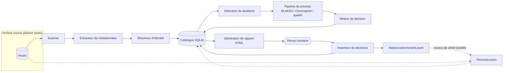
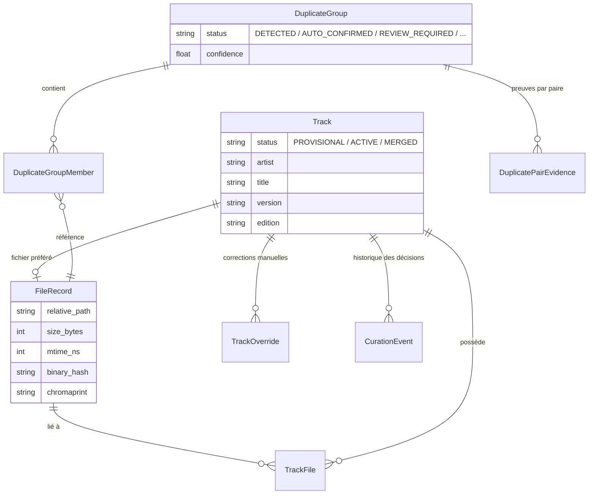
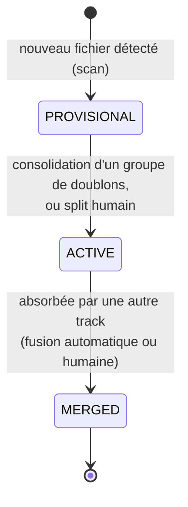
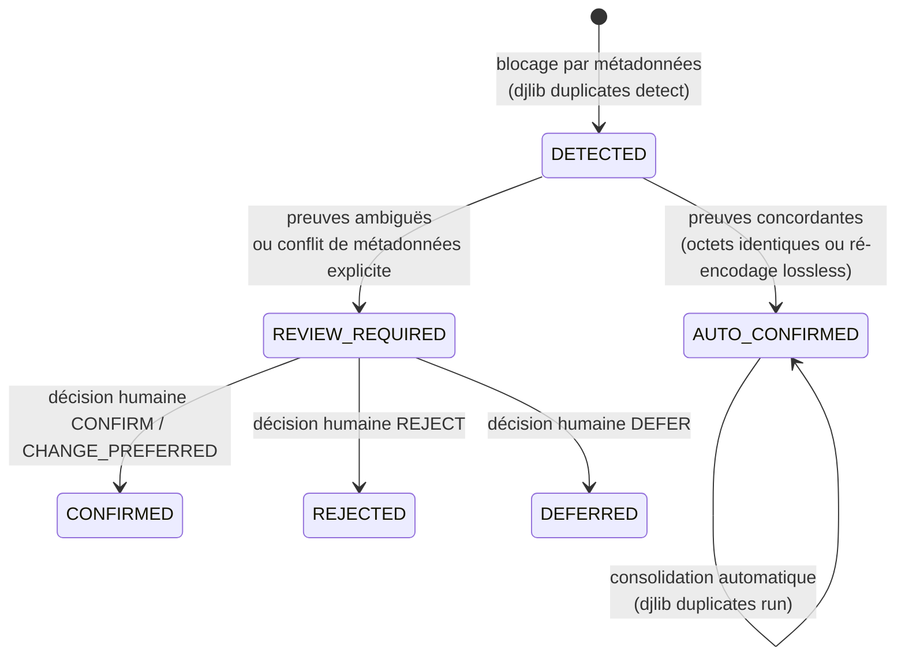

# Architecture de djlib

Ce document explique **comment djlib fonctionne à l'intérieur** : ses
composants, son modèle de données simplifié, et le cycle de vie des objets
qu'il manipule. Pour l'installation, voir [`installation.md`](installation.md) ;
pour le détail de chaque commande, voir [`commandes.md`](commandes.md).

> Le document de conception complet (exhaustif, à destination des
> contributeurs) vit dans
> [`docs/superpowers/specs/2026-08-15-djlib-milestone-1-catalog-dedup-design.md`](superpowers/specs/2026-08-15-djlib-milestone-1-catalog-dedup-design.md).
> Cette page en est un résumé pédagogique.

## Le principe fondateur : ne jamais toucher à la source

Tout dans djlib découle d'une seule règle : **`/music` est en lecture
seule**, physiquement (le point de montage LXC lui-même est monté `ro=1`).
djlib ne renomme, ne déplace, ne supprime et ne retague jamais un fichier
source. Son rôle s'arrête à l'**analyse** : cataloguer, comparer, proposer,
et mémoriser les décisions humaines. Décider quoi faire concrètement d'un
doublon sur le disque (le supprimer, l'archiver...) reste une action manuelle
de l'opérateur, hors du périmètre de l'outil.

Cette règle a une conséquence directe sur l'architecture : puisque rien
n'est jamais modifié dans `/music`, **le catalogue (`catalog.sqlite`) n'est
qu'une vue reconstructible** de ce qui existe sur le disque, enrichie des
décisions humaines déjà prises. C'est ce qui rend `djlib rebuild` possible
(voir plus bas).

## Les composants

| Composant | Rôle | Module |
| --- | --- | --- |
| **Scanner** | Parcourt `/music` et ne retient que des informations bon marché : chemin, taille, date de modification, présence. | `djlib.scan.scanner` |
| **Extracteur de métadonnées** | Lit les tags embarqués (ExifTool) et les informations techniques du flux audio (ffprobe). Ne fait que lire, jamais écrire. | `djlib.metadata` |
| **Résolveur** | Transforme les métadonnées brutes en identité structurée (artiste / titre / version / édition), avec une priorité claire : tag valide → repli sur le nom de fichier → inconnu. Ne fusionne jamais deux fichiers entre eux. | `djlib.resolve` |
| **Catalogue** | Persiste les fichiers, les tracks provisoires, l'historique des scans et l'état d'analyse dérivé. | `djlib.catalog` |
| **Détecteur de doublons** | Construit des groupes de fichiers *candidats* par blocage sur les métadonnées (artiste/titre/durée), sans rien calculer de coûteux à ce stade. | `djlib.duplicates.blocking` |
| **Pipeline de preuves** | Calcule les preuves coûteuses, mais *seulement* pour les candidats déjà identifiés : hash binaire BLAKE3, empreinte acoustique Chromaprint, analyse de qualité technique. | `djlib.duplicates.hashing` / `chromaprint` / `quality` |
| **Moteur de décision** | Classe chaque paire de fichiers (identiques, équivalents, probables, différents, en conflit) et propose un fichier "préféré" quand la confiance est suffisante. | `djlib.duplicates.classifier` / `preferred` |
| **Générateur de rapport** | Produit une page HTML statique de revue humaine. Ne fait que lire la base ; n'a aucun chemin d'écriture. | `djlib.report.generator` |
| **Importeur de décisions** | Valide un fichier `decisions.json` exporté depuis le rapport, vérifie qu'il n'est pas périmé, puis applique les décisions de façon atomique. | `djlib.curation.decisions` |
| **Journal de curation** | Exporte chaque décision humaine acceptée vers `/data/curation/events.jsonl`, la source de vérité durable utilisée par `rebuild`. | `djlib.curation.journal` |
| **Docteur** | Exécute une série de contrôles de santé (montages, migrations, exécutables requis, invariants internes). | `djlib.doctor` |

## Le modèle de données, simplifié

Deux notions structurent tout le reste : le **fichier** (`FileRecord`, un
objet physique sous `/music`) et la **track** (`Track`, une version audio
précise). Une track peut regrouper plusieurs fichiers (le même morceau en
FLAC et en MP3, par exemple), mais deux versions différentes du même
morceau — un Radio Edit et un Original Mix — restent deux tracks distinctes.
C'est la règle la plus importante du projet (voir
`.claude/rules/duplicate-detection.md`) : **on ne fusionne jamais par
ressemblance de tags, seulement sur preuve (pipeline automatique) ou décision
humaine explicite.**

## Cycle de vie d'une track

Chaque fichier nouvellement scanné démarre comme sa propre track
`PROVISIONAL` : c'est une identité "brute", pas encore confirmée par le
pipeline de doublons. Quand un groupe de fichiers est reconnu comme le même
enregistrement (automatiquement ou via une décision humaine), une des tracks
devient `ACTIVE` (la survivante) et les autres passent à `MERGED`, avec un
pointeur vers la track qui les a absorbées — rien n'est jamais perdu,
seulement archivé.

## Cycle de vie d'un groupe de doublons

Le classement `AUTO_CONFIRMED` est volontairement strict : il ne sert que
pour des cas sans ambiguïté (copie binaire identique, ou même morceau
ré-encodé sans perte). Dès qu'un doute existe — remix vs original, radio
edit vs extended, preuve technique qui contredit les métadonnées — le
groupe reste `REVIEW_REQUIRED` et attend un humain. Ce choix est documenté
dans `.claude/rules/duplicate-detection.md` : *"jamais de fusion automatique
sur la seule ressemblance audio face à des métadonnées qui se contredisent"*.

## La garantie de reconstruction (`djlib rebuild`)

C'est la preuve concrète que rien n'est perdu si la base SQLite est
endommagée ou perdue : `djlib rebuild`

1. vérifie que `/music` est bien accessible (sinon, abandon avant de toucher
   quoi que ce soit) ;
2. sauvegarde la base actuelle (conservée même en cas de succès) ;
3. recrée une base vide et migrée ;
4. relance un scan complet de `/music` ;
5. **rejoue** `/data/curation/events.jsonl` — l'historique de toutes les
   décisions humaines (fusions, splits, corrections, confirmations de
   doublons...) ;
6. exécute les vérifications d'invariants du docteur.

Le résultat est, par construction, identique à l'état d'avant l'incident :
`/music` (immuable) + le journal de curation (append-only, jamais réécrit)
suffisent à tout reconstruire. C'est l'invariant central du projet (design
§25/§33, `.claude/rules/curation-persistence.md`) : *"SQLite est une
projection reconstructible ; `/music` + le journal sont la seule source de
vérité durable."*
