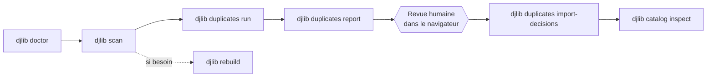

# Les commandes de djlib

Ce document détaille **chaque commande** : à quoi elle sert, comment elle
fonctionne, et un exemple d'utilisation. Pour une vue d'ensemble du
fonctionnement interne, voir [`architecture.md`](architecture.md).

## Un usage typique, dans l'ordre



`scan`, `duplicates run` et `rebuild` affichent une **barre de progression
en direct** (étape en cours + compteur, par exemple `scanning 128/512`) —
jamais le chemin complet d'un fichier, pour que le terminal reste lisible
même sur une très grosse bibliothèque.

---

## `djlib doctor`

**Rôle :** un bilan de santé complet. À lancer en premier sur une nouvelle
installation, et à chaque fois qu'un doute existe.

**Vérifie :**

- `/music` existe et est bien monté en lecture seule (tentative d'écriture
  contrôlée, qui doit échouer) ;
- `/data` existe et est bien accessible en écriture ;
- la base SQLite est lisible et à jour (migrations appliquées) ;
- les exécutables requis (`exiftool`, `ffprobe`, `fpcalc`) sont sur le
  `PATH` ;
- la bibliothèque BLAKE3 est utilisable ;
- le journal de curation (`events.jsonl`) est cohérent avec la base ;
- quelques invariants internes (pas de fichier lié à deux tracks actives à
  la fois, tout fichier "préféré" existe bien, etc.).

```bash
djlib doctor
djlib doctor --repair-journal   # exporte d'abord les événements en attente
```

Un `[FAIL]` explique toujours la cause et, souvent, la commande à lancer
pour corriger (`alembic upgrade head`, par exemple).

---

## `djlib scan`

**Rôle :** parcourt `/music` et met à jour le catalogue de façon
incrémentale.

**Fonctionnement :** pour chaque fichier audio trouvé,

- **nouveau chemin** → extraction des métadonnées, résolution d'identité,
  création d'une track `PROVISIONAL` ;
- **chemin connu, taille et date inchangées** → rien à refaire (aucun appel
  à ExifTool/ffprobe) ;
- **chemin connu, taille ou date modifiée** → ré-extraction, ré-résolution,
  et invalidation du cache d'analyse (hash binaire, empreinte Chromaprint,
  qualité) ;
- **chemin connu mais absent de ce scan** → marqué non présent, mais
  jamais supprimé de la base (l'historique reste intact).

Une erreur d'extraction sur un fichier isolé (tag corrompu, fichier
illisible) est comptée et ne bloque jamais le reste du scan.

```bash
djlib scan          # scan incrémental (rapide)
djlib scan --full   # force une ré-extraction complète de tout
```

---

## `djlib duplicates detect`

**Rôle :** la première moitié de la détection de doublons, volontairement
bon marché : un simple **blocage par métadonnées** (artiste, titre, durée
approchante). Aucun hash, aucune empreinte acoustique, aucune analyse de
qualité à ce stade — seulement des groupes `DETECTED` sans encore de
verdict.

```bash
djlib duplicates detect
```

## `djlib duplicates analyze`

**Rôle :** calcule les preuves coûteuses, mais *seulement* pour les
groupes déjà détectés : hash BLAKE3 (toujours), empreinte Chromaprint et
similarité (seulement si les hash diffèrent), puis classe chaque paire et
propose un fichier préféré. Ne touche jamais un groupe déjà tranché par un
humain (`CONFIRMED`/`REJECTED`/`DEFERRED`).

```bash
djlib duplicates analyze
```

## `djlib duplicates run`

**Rôle :** l'enchaînement complet et le plus courant — `detect` + `analyze`
+ consolidation automatique, mais **seulement** pour les groupes classés
`AUTO_CONFIRMED` (copie identique, ou même version ré-encodée sans perte).
Tout ce qui est ambigu reste `REVIEW_REQUIRED`, en attente d'une revue
humaine — jamais fusionné à l'aveugle.

```bash
djlib duplicates run
```

## `djlib duplicates stats`

**Rôle :** un instantané rapide — combien de groupes dans chaque état,
combien de paires dans chaque classification.

```bash
djlib duplicates stats
```

## `djlib duplicates calibrate`

**Rôle :** avant de faire confiance à la classification automatique à
l'échelle de toute une bibliothèque, cette commande exporte les preuves de
chaque paire candidate (hash toujours, Chromaprint/similarité seulement si
les hash diffèrent) pour un échantillonnage manuel : doublons binaires
exacts (témoins positifs), remix/edit/bootleg explicites (témoins négatifs),
vraies paires multi-encodage. **Ne modifie jamais rien** — ni groupe, ni
seuil. Si des faux positifs apparaissent au seuil actuel, ajustez
`[duplicates.chromaprint]` dans la configuration et relancez
`duplicates run`.

```bash
djlib duplicates calibrate                    # CSV sur stdout
djlib duplicates calibrate --json --output evidence.json
```

## `djlib duplicates export`

**Rôle :** exporte les groupes de doublons sous forme de données plates —
une ligne par groupe (statut, confiance, fichiers membres, fichier préféré
proposé, raisons de classement). À ne pas confondre avec `djlib duplicates
report` : pas de page interactive, pas de manifeste, pas de workflow de
décision — juste un instantané exportable de l'état courant des groupes.

```bash
djlib duplicates export                         # CSV sur stdout
djlib duplicates export --format html           # page HTML autonome
djlib duplicates export --output duplicates.csv
```

## `djlib duplicates report`

**Rôle :** génère une page HTML **statique et autonome** (pas de serveur,
pas de connexion base de données depuis le navigateur) listant chaque
groupe de doublons avec ses preuves, ses raisons de classement et un
fichier préféré proposé.

```bash
djlib duplicates report
# -> /data/reports/duplicates-review-<horodatage>/index.html
```

Ouvrez `index.html` dans un navigateur, passez en revue chaque groupe
`REVIEW_REQUIRED`, puis exportez un `decisions.json` (CONFIRM /
CHANGE_PREFERRED / REJECT / DEFER par groupe) **depuis la page elle-même**.

## `djlib duplicates import-decisions`

**Rôle :** applique de façon **atomique** un `decisions.json` exporté par
le rapport. Tout est validé avant la moindre écriture : schéma JSON,
version, fraîcheur du catalogue (un `scan` entre-temps invalide le
rapport), existence des groupes/fichiers référencés, état encore
`REVIEW_REQUIRED` du groupe. La moindre anomalie rejette **tout le
fichier** — il n'y a pas d'application partielle, pas de `--force`.

`CONFIRM`/`CHANGE_PREFERRED` consolident le groupe sur une seule track ;
`REJECT`/`DEFER` enregistrent la décision humaine sans rien fusionner.
Chaque décision acceptée est aussitôt exportée vers
`/data/curation/events.jsonl`.

```bash
djlib duplicates import-decisions /data/decisions/decisions.json
```

---

## `djlib catalog stats`

**Rôle :** vue d'ensemble du catalogue — nombre de fichiers (total /
présents / absents), tracks par statut, historique des scans.

```bash
djlib catalog stats
```

## `djlib catalog export`

**Rôle :** exporte le catalogue complet — une ligne par fichier, avec
l'identité effective de sa track (artiste/titre/version/édition,
artistes en featuring), ses métadonnées techniques et le dernier score de
qualité connu (s'il a déjà été calculé par `duplicates analyze`).

```bash
djlib catalog export                     # CSV sur stdout
djlib catalog export --format html       # page HTML autonome, triable/filtrable
djlib catalog export --output catalog.csv
```

## `djlib catalog inspect <public-id>`

**Rôle :** la commande d'investigation. Donnez un identifiant `fil_...`
(fichier) ou `trk_...` (track), et obtenez : métadonnées brutes et
résolues, identité effective (après correction humaine éventuelle), le
groupe de doublons auquel le fichier appartient avec ses preuves, le
fichier préféré et sa justification, et **tout l'historique des décisions
humaines** qui ont mené à l'état actuel.

```bash
djlib catalog inspect trk_8f2c1a90b6
```

---

## `djlib stats export`

**Rôle :** exporte, en une seule table plate (catégorie / métrique /
valeur), les mêmes compteurs que `catalog stats` et `duplicates stats`
affichent séparément sur le terminal — fichiers, tracks par statut, scans,
groupes de doublons par statut, paires par classification.

```bash
djlib stats export                    # CSV sur stdout
djlib stats export --format html
djlib stats export --output stats.csv
```

---

## `djlib runs show <run-id>`

**Rôle :** chaque commande qui modifie l'état (`scan`, `duplicates
detect/analyze/run/report`, `import-decisions`) enregistre une exécution
(`OperationRun`) avec sa commande, son statut, ses horodatages et un
résumé. Cette commande affiche cet enregistrement pour un `run-id` donné —
pratique pour vérifier après coup ce qu'une exécution a réellement fait.

```bash
djlib runs show scan_22f50200a07240249529b10adc672c90
```

---

## `djlib rebuild`

**Rôle :** la preuve concrète que le catalogue est intégralement
reconstructible à partir de `/music` et du journal de curation seuls (voir
[`architecture.md`](architecture.md#la-garantie-de-reconstruction-djlib-rebuild)
pour le détail des étapes). À utiliser après un incident sur la base SQLite,
ou simplement pour vérifier que la garantie tient toujours.

```bash
djlib rebuild
```

Cette commande peut prendre du temps sur une grosse bibliothèque : voir
[`installation.md`](installation.md#exécuter-une-commande-longue-en-tâche-de-fond)
pour la lancer en tâche de fond sur le conteneur Proxmox et la laisser
tourner en votre absence.

**Ce qu'elle fait, dans l'ordre :** vérifie `/music` (abandon immédiat si
absent), sauvegarde la base actuelle (conservée même en cas de succès),
recrée une base migrée à vide, relance un scan complet, rejoue le journal
de curation, puis exécute les invariants du docteur.
